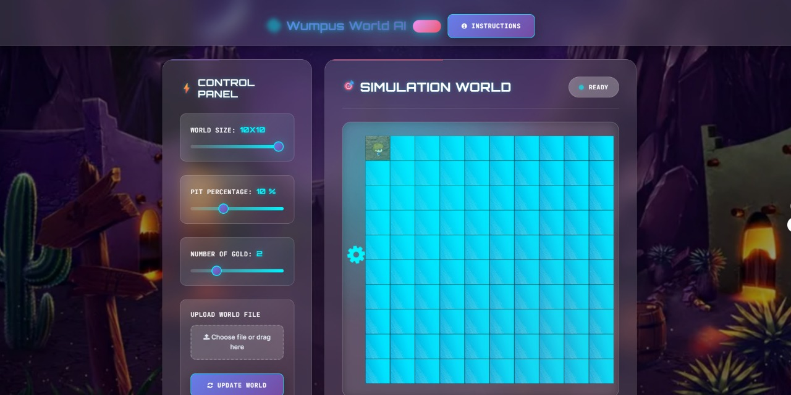

# Wumpus World



Test case passed
Wumpus World is a simulation of the classic AI problem-solving environment. It is a grid-based game where an agent navigates through a cave to find gold, avoid pits, and kill the Wumpus while adhering to logical rules. 

## Features

- **Interactive Gameplay:** Explore a grid-based environment with realistic textures and animations.
- **AI Integration:** Includes an AI agent with pathfinding algorithms like A*.
- **Customizable World:** Modify grid dimensions, agent start position, and obstacles.
- **Rich Assets:** Includes images, sounds, and textures for an immersive experience.

## Project Structure

```plaintext
wumpus-world/
├── assets/                 # Game assets like images and sounds
│   ├── sounds/             # Audio files for game events
│   ├── textures/           # Textures for game elements
│   └── ...
├── css/                    # Stylesheets
├── img/                    # Icons and logos
├── js/                     # JavaScript logic for game components
├── .git/                   # Git repository metadata
├── app.js                  # Main application logic
├── index.html              # Entry point for the game
├── package.json            # Node.js dependencies
├── package-lock.json       # Dependency lockfile
└── README.md               # Documentation (this file)
```

## Getting Started

Follow these steps to set up and run the project on your local machine.

### Prerequisites

- **Node.js** (>= 14.x)
- A modern web browser (Chrome, Firefox, etc.)

### Installation

1. Clone the repository:

   ```bash
   git clone 
   cd wumpus-world
   ```

2. Install dependencies:

   ```bash
   npm install
   ```

### Running the Game

Start the application with the following command:

```bash
npm start
```

Then, open [http://localhost:5000](http://localhost:5000) in your web browser to play the game.

## Game Rules

1. The agent starts in the bottom-left corner of the grid.
2. The goal is to collect gold and exit the cave safely.
3. Avoid pits and the Wumpus (a dangerous creature).
4. The agent can shoot an arrow to kill the Wumpus.
5. Utilize sensory hints like breeze (near pits) and stench (near the Wumpus).

## Development

### Key Scripts

- `agent.js`: Defines the behavior of the agent.
- `ai.js`: Implements AI algorithms for decision-making.
- `world.js`: Manages the game environment.
- `simulate.js`: Handles game simulation.

### Assets

- **Sounds:** Provide audio feedback for game actions (e.g., `wind.wav`, `victory.wav`).
- **Textures:** Enhance visual elements (e.g., `agent_down.png`, `gold.png`).

### Customization

Modify the `app.js` file to customize grid size, initial conditions, or other game settings.

## Contributions

Contributions are welcome! If you have suggestions or want to report issues, please open an issue or submit a pull request.

## License

This project is licensed under the [MIT License](LICENSE).

## Acknowledgments

- Inspired by the Wumpus World problem in AI.
- Assets and sounds designed for educational purposes.

---

Enjoy exploring the Wumpus World and testing your logical reasoning skills!
